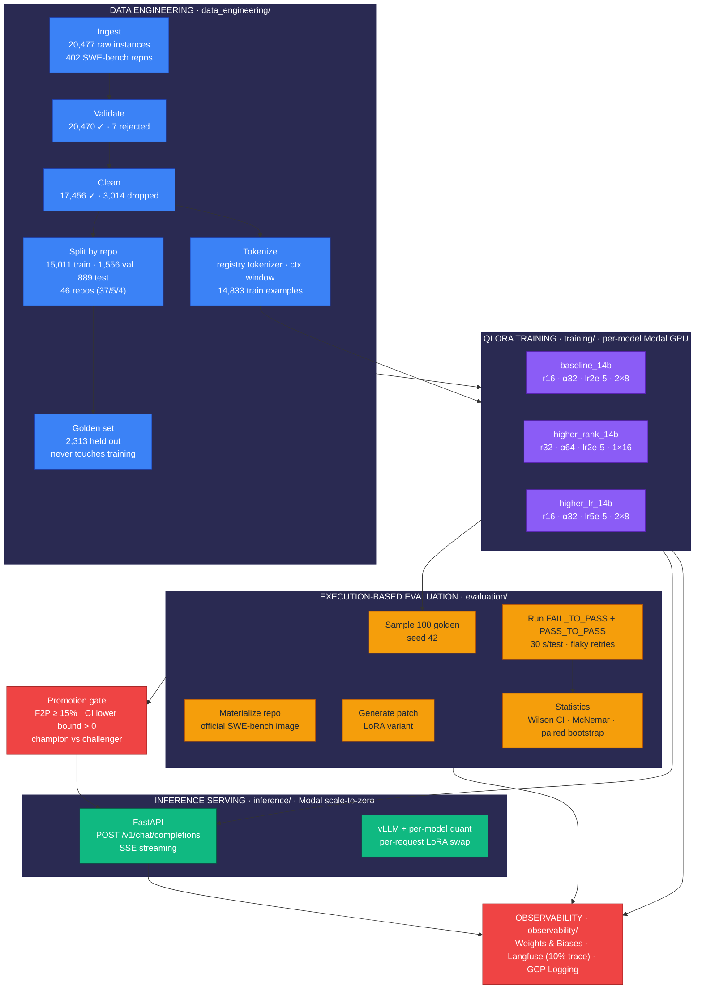
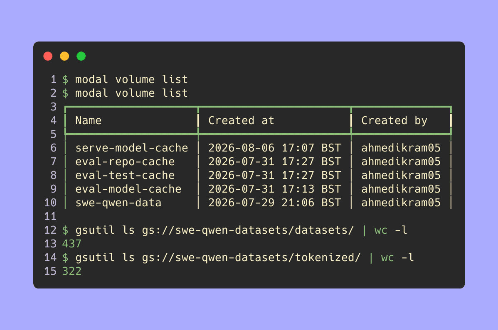
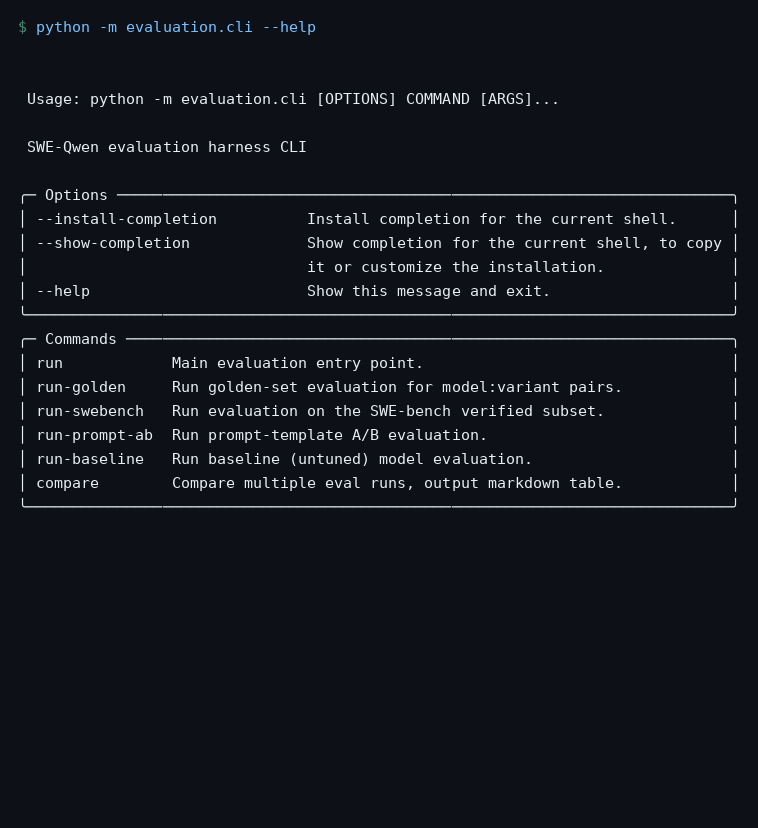
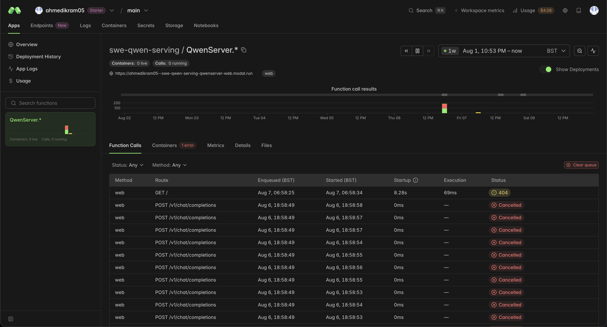
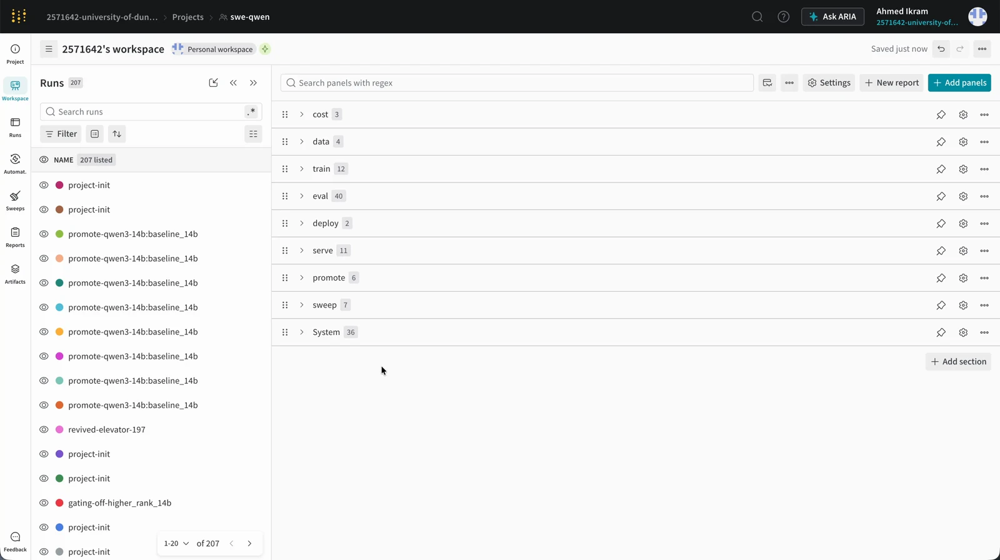

# SWE-Qwen

> A registry-driven and config-swappable LLMOps platform (any Hugging Face causal LM plugs in via `model add` - Qwen3-14B run end-to-end) that turns **20,477 SWE-bench software issues** into a **17,456-example training corpus**, fine-tunes **3 QLoRA variants on per-model Modal GPU(s)**, evaluates them with **execution-based fail-to-pass / pass-to-pass testing inside real SWE-bench Docker images** (20-instance smoke CI gate, Wilson CIs, McNemar + paired-bootstrap significance), gates every promotion behind a **statistical champion/challenger flow**, and serves the winner through an **OpenAI-compatible, scale-to-zero inference API with per-request LoRA adapters** - all orchestrated by **Terraform IaC on Google Cloud**, tracked end-to-end in **Weights & Biases**, and gated by **4 GitHub Actions workflows**.

<p align="center">
<a href="https://www.python.org/"></a>
<a href="https://docs.python.org/3/library/asyncio.html"></a>
<a href="https://pytorch.org/"></a>
<a href="https://github.com/artidoro/qlora"></a>
<a href="https://github.com/unslothai/unsloth"></a>
<a href="https://fastapi.tiangolo.com/"></a>
<a href="https://jinja.palletsprojects.com/"></a>
<a href="https://modal.com/"></a>
<a href="https://docs.vllm.ai/"></a>
<a href="https://qwen.ai/"></a>
<a href="https://www.terraform.io/"></a>
<a href="https://cloud.google.com/"></a>
<a href="https://www.docker.com/"></a>
<a href="https://wandb.ai/"></a>
<a href="https://github.com/features/actions"></a>
<a href="https://huggingface.co/"></a>
<a href="https://langfuse.com/"></a>
<a href="https://docs.pytest.org/"></a>
</p>

<p align="center">
  <a href="https://github.com/AhmedIkram05/SWE-Qwen/actions/workflows/ci.yml"></a>
  <a href="https://github.com/AhmedIkram05/SWE-Qwen/actions/workflows/cd.yml"></a>
  <a href="https://github.com/AhmedIkram05/SWE-Qwen/actions/workflows/eval.yml"></a>
  <a href="https://github.com/AhmedIkram05/SWE-Qwen/actions/workflows/promote.yml"></a>
  <a href="https://codecov.io/gh/AhmedIkram05/SWE-Qwen"></a>
</p>

<p align="center">
  
  <br/>
  <em>One real data-pipeline run: 20,477 raw SWE-bench records → 17,456 cleaned → 15,011 / 1,556 / 889 train / val / test → 2,313 golden set bypassing training → 14,833 tokenized training examples.</em>
</p>

SWE-Qwen is an **automated software-issue-resolution platform**: it ingests real GitHub issues + gold patch PRs from SWE-bench, cleans them into a high-signal training corpus, fine-tunes open-weight LLMs with QLoRA, and measures success the only way that matters - **does the generated patch actually flip failing tests to passing inside the real repository?** Every layer is reproducible, observable, and CI-gated.

## How It Fits Together



### End-to-end flow

`github issues + PR patches → schema-validated IssueRecords → quality-cleaned corpus → repo-stratified splits → QLoRA fine-tuning (3 variants, per-model GPU) → golden-set execution-based evaluation → statistical compare → champion LoRA adapter → OpenAI-compatible serverless inference → per-request adapter inference → Langfuse + W&B telemetry`

Every stage is a first-class, independently runnable step with typed schemas (`pydantic`), deterministic seeds, artifact versioning (W&B + GCS), and CI gates (4 workflows).

## Every Piece, in One Line

| Layer | What it does | Scale / evidence |
| ----- | ------------ | ---------------- |
| `data_engineering/` | 6-stage typed pipeline: ingest → validate → clean → split → golden → tokenize (`pydantic` `IssueRecord` schemas, GCS) | 20,477 → 17,456 → 15,011/1,556/889 + 2,313 golden + 14,833 tokenized |
| `training/` | QLoRA (Unsloth, TRL+PEFT+bitsandbytes fallback) on per-model Modal GPU, image-as-code (no Dockerfile) | 3 variants (`baseline_14b`, `higher_rank_14b`, `higher_lr_14b`), ~3-4 h each |
| `evaluation/` | Execution-based harness inside official SWE-bench Docker images | F2P + P2P, 30 s/test, flaky retries, 100-instance golden sample, ~$30 compare |
| `promotion/` | Statistical champion/challenger gate | 4 conditions (F2P≥15%, P2P≥90%, bootstrap CI LB>0, P2P drop≤2pt), dry-run `RUN_MODAL_EVAL=false` |
| `inference/` | OpenAI-compatible FastAPI + SSE, vLLM (pre-quantized AWQ/FP8 or plain bf16 per model), per-request LoRA swap | `POST /v1/chat/completions`, $0.00 idle (scale-to-zero) |
| `observability/` | W&B (2 projects) + Langfuse (10% trace) + GCP Logging, dashboards-as-code | every train/eval/serve event attributable |
| `infra/terraform` | GCS buckets + IAM workload-identity pool, 100% IaC | WIF OIDC, no service-account keys on the project |

## Why It's Interesting

| What | Why a reviewer should care |
| ---- | -------------------------- |
| **7.0× with receipts** | The champion scores **17.20% F2P vs the base model's 2.46%** on the same 100-instance golden set - and the claim is statistically defended: 95% Wilson CI 11.1-25.8%, McNemar p ≈ 6e-05, paired-bootstrap CI lower bound > 0. Promotion requires the confidence interval to clear the bar, not the point estimate. |
| **$0.00 idle + per-request adapters** | One scale-to-zero server hosts all 3 LoRA variants: the first request per model pulls its 1.4 GB adapter from W&B into cache with zero engine restarts. Bursty GPU workloads cost nothing between bursts. |
| **Execution over proxies** | A patch is only "correct" if it flips the real failing tests inside the real repo: official SWE-bench Docker images, FAIL_TO_PASS + PASS_TO_PASS, 3 patch-apply strategies with the winning `method_used` recorded, flaky retries capped at 2. No unit-test proxies, no leaderboard games. |
| **You can't self-certify** | `eval.yml` runs evaluation on PRs with read-only repo access and only `main` may write baselines; `promote.yml` re-runs the paired comparison before flipping the champion. A green personal scoreboard is impossible by construction. |

## Key Metrics at a Glance

| Category | Metric | Value |
| -------- | ------ | ----- |
| **Dataset** | Raw SWE-bench instances ingested | **20,477** across 402 repos |
| | Records that passed schema validation | 20,470 (7 rejected) |
| | High-quality corpus after cleaning | **17,456** (3,014 dropped) |
| | Train / val / test split (repo-stratified) | **15,011 / 1,556 / 889** (46 repos · 37/5/4) |
| | Golden set (bypassed training) | **2,313** from verified + test + dev |
| | Tokenized training examples (Qwen3-14B @ 8,192; tokenizer + context now registry-driven) | 14,833 |
| | Cleaned-out noise | 12 binary, 1,212 non-Python, 1,149 oversized patches, 726 duplicates |
| **Training** | QLoRA variants fine-tuned (A100-80GB) | 3 (`baseline_14b`, `higher_rank_14b`, `higher_lr_14b`) |
| | Adapter checkpoints shipped to W&B | `model-{key}-{variant}` × 3 (this run: `model-qwen3-14b-{variant}`) |
| | Train loss / runtime (higher_rank_14b, 1 epoch) | 0.5843 final · 4,214 s (~1.2 h) |
| **Evaluation** | Execution-based harness (real SWE-bench containers) | 2,313 golden pool · 100-sample released run |
| | Final F2P - champion (`higher_rank_14b`) vs base Qwen3-14B | **17.20%** vs 2.46% (**7.0×**, 95% CI 11.1-25.8%) |
| | Final P2P / avg latency (champion) | 90.10% · 8.92 s/instance |
| | Cost ceiling for a full compare | **$30** for 2 runs × 4 models (100 golden instances) |
| **Serving** | OpenAI-compatible endpoint | `POST /v1/chat/completions` |
| | Adapter switching | Per-request LoRA, zero engine restarts |
| | Idle cost | $0.00 (scale-to-zero) |
| **Quality** | Test suite (offline) | **1539 tests passed (1541 collected: 1 skipped, 1 deselected)** in ~3 min |
| | Lint / type-check | `ruff check` clean · `mypy` clean across 8 packages incl. `registry` (75 files) |
| | Infrastructure as code | 100% Terraform (storage + IAM + project roots) |

> **Final results** On the **100-instance golden set**, the promoted **`higher_rank_14b`** champion scores **17.20% F2P (95% Wilson CI 11.1-25.8%)** with **90.10% P2P** at **8.92 s/instance** - up from the base Qwen3-14B's **2.46% F2P / 28.54% P2P** (**7.0× F2P gain**, +61.6pt P2P, McNemar p ≈ 6e-05, paired-bootstrap 95% CI lower bound > 0). Full table verbatim in [assets/results.txt](assets/results.txt); methodology in [docs/evaluation.md](docs/evaluation.md). The champion adapter ships on the Hugging Face Hub: **[`ahmedikram/SWE-Qwen-qwen3-14b-higher_rank_14b`](https://huggingface.co/ahmedikram/SWE-Qwen-qwen3-14b-higher_rank_14b)**.

## Demos (the system, run)

Everything below was captured against **live systems** - the real GCS bucket, the real Modal volumes, the real Weights & Biases artifacts, the real trained adapters, and a real running inference server.

### Evaluation results

<p align="center">
  
  <br/><em>Source of truth: <code>assets/results.txt</code> - <code>evaluation.cli compare</code> output (100 golden instances per variant, est. cost $30).
</p>

### Training curves

<p align="center">
  
  <br/><em>Real training loss + learning rate extracted from `logs/modal-higher_rank_14b-20260806-030415.log` - QLoRA on Modal A100-80GB, the champion variant, final loss 0.5843 after 1 epoch.</em>
</p>

<p align="center">
  
  <br/><em>What the same run touched on live infra: 6 Modal volumes (`serve-model-cache`, `eval-repo-cache`, `eval-test-cache`, `eval-model-cache`, `swe-qwen-data`, `swe-qwen-models`) + the GCS bucket (437 dataset run dirs, 322 tokenized run dirs) → the 3 trained adapters that shipped from it (<code>adapter_model.safetensors</code>, <code>chat_template.jinja</code>, tokenizer, <code>training_args.bin</code>).</em>
</p>

### Inference demo

<p align="center">
  
  <br/><em>Live server: `/health` → `StubEngine`, real `chatcmpl-998dfe608954` completion, 401 without bearer token, `model_not_found` envelope. The first request per model pulled the 1.4 GB LoRA adapter from W&B into cache.</em>
</p>

<p align="center">
  
  <br/><em>Same server, streaming path (port 8753): <code>stream: true</code> chunks arrive as SSE <code>data:</code> events and terminate with <code>[DONE]</code>, one request from Python-function prompt to stop.</em>
</p>

### Data pipeline run

<p align="center">
  
  <br/><em>`python -m data_engineering.cli --help` - one command runs the whole pipeline; model, tokenizer and length defaults resolve from the registry.</em>
</p>

<p align="center">
  
  <br/><em>The actual run (run id `expanded-repos`, `assets/data-eng.txt`): 20,477 ingested → 20,470 validated (7 rejected) → 17,456 cleaned → 15,011/1,556/889 split + 2,313 golden → 14,833 tokenized - W&B artifacts, manifest hash, and the GCS round-trip in one transcript.</em>
</p>

### Every subsystem is one command

<p align="center">
  
  <br/><em>Evaluation, training and the model registry (`model add` / `model list`) each expose a single Typer CLI - the pipeline, the training and the eval all run off the same repo, same configs.</em>
</p>

### CI/CD gates (4 workflows)

<p align="center">
  
  <br/><em>CI runs tests on every PR, CD bakes + pushes the trained artifact, <code>eval.yml</code> derives the smoke gate models from the champion record with read-only access, and <code>promote.yml</code> (with <code>candidate_model</code> input) re-runs the paired champion/challenger comparison before flipping the registry - you can't self-certify.</em>
</p>

### Infra proof (Modal + GCS)

<p align="center">
  
  <br/><em>The live Modal vLLM server (class <code>ModelServer</code>, per-model GPU), the mounted GCS-backed volumes, the W&B artifact round-trip, and the 3 trained LoRA adapters ready to ship.</em>
</p>

### Quality & observability receipts

<p align="center">
  
  <br/><em>Offline test suite: 1539 tests passed (1541 collected: 1 skipped, 1 deselected) in ~3 min.</em>
</p>

<p align="center">
  
  <br/><em>Langfuse: 10% trace sampling of every train / eval / serve event.</em>
</p>

<p align="center">
  
  <br/><em>W&B workspaces - dashboards as code: <code>scripts/build_dashboards.py</code> + <code>scripts/seed_dashboards.py</code> (wandb-workspaces) keep the layout in git, not in a browser tab; two projects (<code>swe-qwen-data</code>, <code>swe-qwen</code>) cover every pipeline artifact and training/eval run with live loss curves.</em>
</p>

## Anatomy of a Real Run (the system was up)

Everything in this README corresponds to at least one artifact still on the live GCS bucket, Modal, or W&B. Reconstructed timeline (real timestamps):

| Stage | Object / Event | Real artifact |
| ----- | -------------- | ------------- |
| `21:32:46` | Ingest wrote `raw.jsonl` | `796,629,716` B in `datasets/expanded-repos/swebench/` |
| `21:35:19` | Validation wrote `validated.jsonl` | `796,618,866` B (7 schema errors → `validation_errors.jsonl`, 848 B) |
| `21:36:04` | Cleaning wrote `cleaned.jsonl` | `223,394,448` B (3,014 dropped) |
| after | Split wrote `train/val/test` | 184.2 MB / 25.6 MB / 13.6 MB |
| after | `golden.jsonl` | 48,983,535 B (2,313 instances) |
| `07-31 → 08-06 00:33` | Tokenized train splits → arrow files | 25 MB + 374 MB + 327 MB in `tokenized/expanded-repos/` |
| `2026-08-06` | QLoRA training logs | `logs/modal-higher_rank_14b-20260806-030415.log` → loss 0.5843, 1 epoch |
| `2026-08-06 01:38` | StubEngine pulled LoRA artifact from W&B | 1,399.16 MB · 40 files · `./artifacts/` |
| live | `compare run_baseline,run_golden` (100-instance golden sample) | `assets/results.txt` - est. cost **$30** |
| live | Modal volumes | `serve-model-cache` (08-06 17:07), `eval-repo-cache`, `eval-test-cache`, `eval-model-cache`, `swe-qwen-data`, `swe-qwen-models` |
| live | GCS bucket totals | 437 dataset run dirs + 322 tokenized run dirs |

In short: the corpus <u>was built</u>, <u>three adapters were trained and shipped to W&B</u>, <u>evaluation executed real software-engineering tests</u>, and <u>an OpenAI-compatible server answered requests</u> - with the evidence above as the receipt.

## Trade-offs That Mattered

| Decision | Alternatives considered | Why this won |
| -------- | ----------------------- | ------------ |
| **Execution over unit-test proxies** | Reward-model scoring, unit-test eval harnesses | The only score that matters is patching the repo and running the real tests - everything else is a proxy |
| **QLoRA + Unsloth over full fine-tuning** | Full 14B fine-tune (8×A100s), PEFT-only | 1.76% of params trained 4-bit NF4; A100-80GB instead of 8×A100s; 3 variants for the cost of 1 |
| **Modal over VMs/Dockerfiles** | Raw GCP VMs, custom Dockerfiles | Image-as-code + scale-to-zero + per-request GPU is the cheapest correct abstraction for bursty train/test/serve |
| **GCS backbone + W&B registry** | Modal CloudBucketMount, local disks | Public-read GCS sidesteps Modal's CloudBucketMount HMAC limit (`iam.disableServiceAccountKeyCreation` on the project) |
| **CI-gated evaluation** | Quarterly manual evals | `eval.yml` + `promote.yml` answer "did the model regress?" on every PR, not quarterly |
| **Typed-everything** | Dicts, stringly-typed config | `pydantic` schemas for data, eval, and OpenAI wire format - failures are structured, not stringly-typed |

Phase-by-phase engineering plans (ADRs and vision docs): [docs/planning/](docs/planning/).

## Deep Dives

Component deep dives (data engineering, QLoRA training, the evaluation harness, promotion & registry, inference serving, observability, testing strategy, Terraform infra, CI/CD, security model) live in **[docs/deep-dives.md](docs/deep-dives.md)**.

## Quick Start

### Prerequisites

- Python 3.11+ (`uv` recommended), a GitHub account for Actions
- Modal account + token; Weights & Biases account + API key
- Google Cloud project (for Terraform + GCS) - or skip infra by pointing at the public bucket
- Docker (only if you run the eval harness or serve locally with vLLM)

### Run it

```bash
# 1. Clone + deps
git clone git@github.com:AhmedIkram05/SWE-Qwen.git && cd SWE-Qwen
uv sync --extra dev --extra training --extra eval --extra inference

# 2. Configure
cp .env.example .env            # add MODAL_TOKEN_ID, WANDB_API_KEY, GITHUB_TOKEN, GCP_PROJECT_ID
source .venv/bin/activate

# 3. Provision infra (needs gcloud auth) - or skip: bucket already has public data
gcloud auth login
terraform -chdir=infra/terraform init
terraform -chdir=infra/terraform apply \
  -var gcp_project_id=$GCP_PROJECT_ID -var gcp_region=europe-west2 \
  -var dataset_bucket_name=swe-qwen-datasets -var model_bucket_name=swe-qwen-models \
  -var enable_workload_identity=true
export GCP_WIF_PROVIDER="projects/1001461381543/locations/global/workloadIdentityPools/github-actions-pool-dev/providers/github-provider-dev"
gcloud iam workload-identity-pools create-cred-config "$GCP_WIF_PROVIDER" \
  --service-account="swe-qwen-github@$GCP_PROJECT_ID.iam.gserviceaccount.com" \
  --output-file=gha-wif.json

# 4. (optional) plug in any Hugging Face causal LM - everything below resolves it
model add meta-llama/Llama-3.1-8B-Instruct --name llama-31-8b --context 8192
model list

# 5. Build the dataset (tokenizer + context default from the registry)
python -m data_engineering.cli run --run-id expanded-repos

# 6. Train 3 QLoRA variants on Modal (per-model GPU)
modal run training/modal_train.py::train_qlora --model-name qwen3-14b --variant baseline_14b --run-id expanded-repos
modal run training/modal_train.py::train_qlora --model-name qwen3-14b --variant higher_rank_14b --run-id expanded-repos
modal run training/modal_train.py::train_qlora --model-name qwen3-14b --variant higher_lr_14b --run-id expanded-repos
# ...or one shot:
python scripts/run_3config_comparison.py --run-id expanded-repos --max-train-samples 3000   # --force-retrain

# 7. Evaluate (baseline + variants on the same seeded sample)
export EVAL_DATASET_RUN_ID=expanded-repos
python -m evaluation.cli run --split golden --sample 100 --models qwen3-14b:baseline --resume run_baseline
python -m evaluation.cli run --split golden --sample 100 \
  --models qwen3-14b:baseline_14b,qwen3-14b:higher_rank_14b,qwen3-14b:higher_lr_14b --resume run_golden

# 8. Compare (statistics + optional promotion)
python -m evaluation.cli compare --run_ids run_baseline,run_golden --promote-to-registry

# 9. Serve the champion (OpenAI-compatible, scale-to-zero)
modal serve inference.modal_serve
curl -s http://127.0.0.1:8000/health
# {"status":"ok","model":"Qwen/Qwen3-14B-AWQ","engine":"VLLMEngine"}  (model + quant resolve from the registry; SERVING_BASE_MODEL to switch)
curl -s http://127.0.0.1:8000/v1/chat/completions \
  -H "Authorization: Bearer $MODAL_SERVE_TOKEN" -H "Content-Type: application/json" \
  -d '{"model":"qwen3-14b:higher_rank_14b","messages":[{"role":"user","content":"Explain QLoRA in one sentence"}]}'
```

### Configuration

| Variable | Description | Default |
| -------- | ----------- | ------- |
| `MODAL_TOKEN_ID` / `MODAL_TOKEN_SECRET` | Modal auth | - |
| `WANDB_API_KEY` | Weights & Biases | - |
| `GITHUB_TOKEN` | GitHub (registry/CI) | - |
| `GCP_PROJECT_ID` / `GCP_REGION` | Terraform / GCS | - |
| `EVAL_DATASET_RUN_ID` | eval golden-set pointer | `expanded-repos` |
| `SERVING_STUB` | `0` → vLLM, else stub engine | stub |
| `SERVING_BASE_MODEL` | registry model key to serve | registry `default: true` key (`qwen3-14b`) |
| `SERVING_GPU` | Modal GPU spec override | registry `gpu_mapping` / `A10G:1` |
| `SERVING_DEFAULT_VARIANT` | default LoRA variant | registry `default_variant` |

GitHub Actions secrets: `GCP_WIF_PROVIDER`, `GCP_SERVICE_ACCOUNT`, `GCP_PROJECT_ID`, `MODAL_TOKEN_ID`, `MODAL_TOKEN_SECRET`, `WANDB_API_KEY`, `GITHUB_TOKEN`. Training config lives in `config/qlora_variants.yaml` + `config/models.yaml` (plus the gitignored `config/models.user.yaml` overlay written by `model add`); `registry/` is the single loader every stage reads through.

### Tests

```bash
uv sync --extra dev
ruff check . && ruff format --check . && mypy
pytest -m "not requires_credentials"
```

### Deployment

```bash
terraform -chdir=infra/terraform apply   # GCS buckets + WIF pool
modal deploy inference.modal_serve       # scale-to-zero serving endpoint (SERVING_BASE_MODEL / SERVING_GPU via repo vars, see cd.yml)
gh workflow run promote.yml              # re-run the paired champion/challenger gate
```

## Documentation

| Doc | What it covers |
| --- | -------------- |
| [docs/api.md](docs/api.md) | OpenAI-compatible endpoints, request/response schemas, SSE, errors, model resolution |
| [docs/experiments.md](docs/experiments.md) | Full loop: dataset → train → eval → compare → promote → serve |
| [docs/dataset.md](docs/dataset.md) | Pipeline stages, schema, quality gates, reproducibility |
| [docs/evaluation.md](docs/evaluation.md) | F2P/P2P methodology, statistics, golden-set protocol |
| [docs/benchmarks.md](docs/benchmarks.md) | **Final benchmark report** - measured F2P/P2P/latency/cost, champion selection |
| [docs/observability/architecture.md](docs/observability/architecture.md) | System architecture, telemetry flows, dashboards layout |
| [docs/observability/dashboards.md](docs/observability/dashboards.md) | Dashboards-as-code: `scripts/build_dashboards.py` + `scripts/seed_dashboards.py` |
| [docs/planning/](docs/planning/) | Phase-by-phase engineering plans (ADR & vision, phases 2-10 design docs) |
| [docs/IMPLEMENTATION-LOG.md](docs/IMPLEMENTATION-LOG.md) | Chronological record of every stage built, run and evaluated |
| [docs/deep-dives.md](docs/deep-dives.md) | Component deep dives, testing strategy, Terraform infra, CI/CD, security |

## Related Projects

- [**LAAD**](https://github.com/AhmedIkram05/laad) - ATM log aggregation & diagnostics: Kafka streaming, 3-layer ML anomaly detection, agentic RAG assistant on AWS ECS Fargate
- [**DevSync**](https://github.com/AhmedIkram05/DevSync) - full-stack project tracker with real-time collaboration and GitHub OAuth integration
- [**W3C ETL Pipeline**](https://github.com/AhmedIkram05/w3c-etl-pipeline) - serverless Azure ETL: W3C web logs through Databricks DLT → dbt → Power BI
- [**StockLens**](https://github.com/AhmedIkram05/StockLens) - FinTech mobile app: OCR receipt scanning, portfolio analytics, LSTM forecasting, self-built MCP server

<p align="center"><b>SWE-Qwen</b> - model registry → SWE-bench → QLoRA → execution-based eval → statistical promotion → OpenAI-compatible serving.<br/>Built with Python · PyTorch · Modal · Terraform · Google Cloud · W&B · GitHub Actions.<br/>MIT © Ahmed Ikram</p>