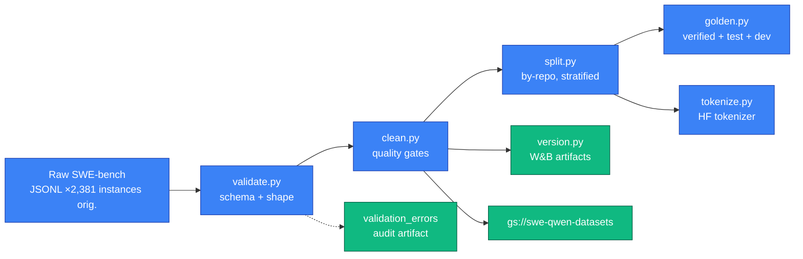

# Dataset Engineering Guide

> How SWE-Qwen turns raw SWE-bench JSONL into a clean, leakage-free, tokenized training corpus — with the record schema, per-stage quality gates, and aggregate numbers from a real run. Code of truth: `data_engineering/` (one module per stage), schema in `data_engineering/schema.py`.

**A real run, end to end:**

| Stage | In | Out | Notes |
| ----- | -- | --- | ----- |
| Ingest | — | 20,477 | SWE-bench raw JSONL files |
| Validate | 20,477 | 20,470 (+7 errors) | Schema + patch-shape checks |
| Clean | 20,470 | 17,456 | −12 binary · −1,212 non-Python · −1,149 oversize · −726 duplicates |
| Split | 17,456 | 15,011 / 1,556 / 889 | 46 repos (37/5/4), by-repo to prevent leakage |
| Golden | — | +2,313 | Held out, never touches training |
| Tokenize | 15,011 / 1,556 / 889 / 2,313 | 14,833 / 1,550 / 885 / 2,304 | Qwen3-14B tokenizer, max_len 8,192 |

Artifacts: W&B `swe-qwen-data` (`dataset-raw:v8`, `validated:v8`, `cleaned:v8`, `train:v23`, `val:v18`, `test:v14`, `golden:v23`, `validation_errors:v2`) + GCS `gs://swe-qwen-datasets/datasets/<run_id>/`.

---

## 1. Record Schema

Every stage operates on the canonical `IssueRecord` (Pydantic, `data_engineering/schema.py`):

| Field | Type | Description |
| ----- | ---- | ----------- |
| `issue_id` | `str` | Stable identifier (SWE-bench `instance_id`-style) |
| `repo` | `str` | Repository (e.g. `django/django`) |
| `pr_number` | `str` | Linked PR, when available |
| `issue_body` | `str` | Problem statement (**validated non-empty**) |
| `patch_diff` | `str` | Gold unified diff (**validated shape**: must parse via `unidiff.PatchSet` or match `---`/`+++`/`@@` headers) |
| `parsed_hunks` | `list[ParsedHunk]` | Parsed hunks: `{file, old_start, old_lines, new_start, new_lines, diff_lines}` |
| `test_results` | `TestResults` | Final-state test outcomes: `{passed[], failed[], errored[]}` |
| `pr_title` / `pr_description` | `str` | PR metadata (context) |
| `commit_messages` | `list[str]` | Commit narrative |
| `files_changed` / `test_files_changed` | `list[str]` | File lists for filtering |
| `issue_labels` | `list[str]` | Labels (topic signals) |
| `repo_domain` | `str` | Domain tag (e.g. `web`, `data`) |
| `metadata` | `dict` | Reserved: verified flag, base/head SHAs, SWE-bench origin |

Two `field_validator`s hard-gate every record at ingestion: `patch_diff` **must** look like a unified diff (unidiff parse first, regex fallback), and `issue_body` **must** be non-empty.

Validation errors are captured, not dropped silently — `ValidationError{record_id, field, error, raw_value}` records feed the `validation_errors` artifact for auditing.

---

## 2. Pipeline Stages



### 2.1 Ingest — `swebench_ingest.py`

Reads the raw SWE-bench JSONL directory, normalizes every issue into an `IssueRecord`, and carries over SWE-bench provenance (`metadata`: base/head SHAs, `fail_to_pass`, `pass_to_pass`, `is_verified`) so evaluation can later re-validate against ground truth. Also extracts the **golden** candidates here (issues with verified F2P signals).

### 2.2 Validate — `validate.py`

Per-record: Pydantic model validation (both field validators above) + structural checks. The goal is *triage*, not judgment: malformed records are isolated with their errors so the rest of the corpus isn't poisoned.

### 2.3 Clean — `clean.py`

The quality gate — every record that survives is trainable. Removals counted in `CleanStats`:

| Gate | Count (real run) | Rationale |
| ---- | ---------------- | --------- |
| Binary patch detected | 12 | `patch_diff` contains NUL / binary markers — untrainable |
| Non-Python majority | 1,212 | Repo domain is Python SWE; keeps data distribution clean |
| Patch too large (> `max_patch_lines` = 500) | 1,149 | Degenerate mega-commits; dominate the context window |
| Empty issue body (`removed_empty_body`) | — | No problem statement → no supervision |
| No test signal (`removed_no_f2p_signal`) | — | No failing→passing test ⇒ no verifiable fix |
| Exact duplicates (`DedupStats.exact_duplicates_removed`) | 468 | Byte-identical records |
| Content duplicates (`DedupStats.content_duplicates_removed`) | 258 | Near-duplicate issues (similarity-based on body+patch) |
| **Total removed** | **3,014** | 20,470 → 17,456 |

### 2.4 Split — `split.py`

Splits **by repository** (not by record) into train / val / test at the configured ratios (default 80/10/10; strict `SplitRatios`):

- Repos are assigned to exactly **one** split (37 train / 5 val / 4 test = 46 in the real run) — records of the same repo never land on both sides of any boundary, so val/test measure **cross-repo generalization**, not in-distribution recall.
- `Splits` keeps `golden` separate from the outset.

### 2.5 Golden — `golden.py`

Carves the **evaluation set** used by the eval harness:

- Sources: **verified** SWE-bench instances + a slice of the `test` and `dev` splits.
- Output: `GoldenSet{records, f2p_verified_count, source_split}` — 2,313 records in the real run.
- Guarantees: disjoint from training/validation splits; fixed `run_id` (immutable once evaluated, so compare results stay comparable).

### 2.6 Tokenize — `tokenize.py`

Converts the splits to model-ready sequences:

```bash
python -m data_engineering.cli tokenize \
  --run-id <id> --model-name qwen3-14b --max-seq-length 8192
```

| Setting | Value | Why |
| -------- | ----- | --- |
| Tokenizer | Qwen3-14B (HF) | Same tokenizer as the base + fine-tune → no id drift |
| `max_length` | 8,192 (real run) | Fits full issue + gold patch; truncation guard is explicit |
| Output | `data/tokenized/<run_id>/*.jsonl` + GCS | Consumed directly by training |

---

## 3. Quality Criteria (DoD for a record)

1. **Schema**: validates as `IssueRecord` (both validators pass).
2. **Patch**: plausible unified diff, ≤ 500 patch lines, no binary content.
3. **Scope**: Python repository; problem statement present.
4. **Signal**: has a failing→passing test pair (verifiable fix), or is carried as golden.
5. **Uniqueness**: not an exact or near-duplicate of a kept record.
6. **Leakage**: its repo belongs to one split only.
7. **Auditability**: any failure produced a `ValidationError` with `record_id` + field + reason.

---

## 4. Reproducibility & Versioning

```bash
# Deterministic full run with a named run_id
python -m data_engineering.cli run \
  --run-id expanded-repos \
  --tokenize-model qwen3-14b --tokenize-max-length 8192

# Resume from a checkpoint (skip completed stages)
python -m data_engineering.cli run --run-id expanded-repos --resume-from cleaned --stages split,golden,tokenize

# Dump the effective config
python -m data_engineering.cli config
```

- Every stage writes versioned **W&B artifacts** (immutable tags) and mirrors raw + cleaned data to **GCS** (`dataset/`, `datasets/expanded-repos/`, `tokenized/expanded-repos/`).
- `PipelineResult` records `run_id`, `manifest_hash`, per-repo `RepoResult` counters, `gcs_paths`, `wandb_artifacts`, and `tokenized_paths` — the full lineage of a run in one object.
- `run.py`'s `--stages` / `--resume-from` make partial re-runs cheap (resume after a flick of a cleaner rule costs one stage, not 20K records).

---

## 5. Storage Layout

```text
gs://swe-qwen-datasets/
├── datasets/<run_id>/              # per-run pipeline output
│   ├── swebench/
│   │   ├── train.jsonl · val.jsonl · test.jsonl · golden.jsonl
│   │   └── validation_errors.jsonl
│   └── ...                          # cleaned / raw mirrors
├── tokenized/<run_id>/             # model-ready sequences (public-read in dev)
└── dataset/                        # shared dataset artifacts

W&B swe-qwen-data (entity <org>):
  artifacts: dataset-raw:v8 · validated:v8 · cleaned:v8 · train:v23 · val:v18 · test:v14 · golden:v23 · validation_errors:v2
```

> **Note on public-read:** the GCP org enforces `iam.disableServiceAccountKeyCreation`, which blocks HMAC keys for private-bucket access from Modal. Dev relies on public-read buckets; production swaps to signed URLs / WIF-authorized access.