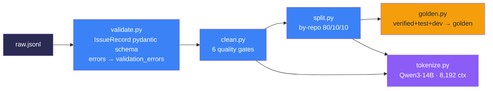
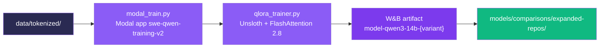
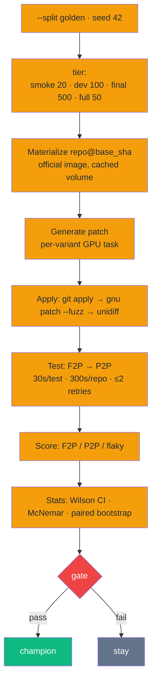
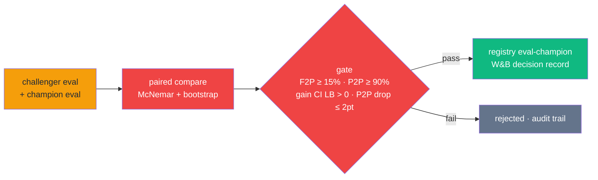

# Deep Dives

> Every subsystem below is independently runnable, CI-gated, and covered end-to-end in `docs/`.

## Component Deep Dives

Each subsystem below is independently runnable, CI-gated, and covered end-to-end in `docs/`.

### 1. Data Engineering (`data_engineering/`)

The data layer turns raw GitHub issue + PR dumps into a tokenized, `pydantic`-typed training corpus - reproducibly, with every stage versioned. The central type is `IssueRecord` (`data_engineering/schema.py`): 14 typed fields covering identity, the issue body, the gold patch (+ parsed hunks), test results, PR context, changed files, and SWE-bench metadata - validated on ingestion so downstream stages never see malformed rows.

**Under the hood - every stage in one command (`python -m data_engineering.cli run`)**:

| Stage | What actually happens | Live gate |
| ----- | --------------------- | --------- |
| `ingest` | Reads SWE-bench from the local Hugging-Face datasets cache (`data/swe_bench/`), fanning out with parallel workers (max 32, batch 50, `--max-issues` cap) → `raw.jsonl` | 20,477 |
| `validate` | Builds `IssueRecord` (pydantic): `patch_diff` must parse as a `unidiff.PatchSet` **or** match `---`/`+++`/`@@` diff headers; field-level errors → `validation_errors.jsonl` | 20,470 ✓ · 7 rejected |
| `clean` | Six counted gates (no test files · patch > 500 lines · binary diffs · non-Python · empty body · no F2P signal), then exact + semantic dedup → `cleaned.jsonl` | 17,456 ✓ · 726 dup |
| `split` | By-repo 80/10/10 (`--train-ratio 0.8`) - a whole repo goes to one split to stop cross-repo leakage | 15,011 / 1,556 / 889 · 46 repos |
| `golden` | Carves the held-out eval set **before** tokenization from verified + test + dev slices (`GoldenSet{records, f2p_verified_count, source_split}`) | 2,313 |
| `tokenize` | Qwen3-14B tokenizer, `max_length=8192` (cap 32768), SFT `packing=true` → arrow datasets via `datasets` | 14,833 train · 2,304 golden |

Every run is hash-pinned in a `manifest.json` + `dataset_card.md`, artifacts are versioned in W&B (`dataset-cleaned:v8`-era tags) and mirrored to `gs://swe-qwen-datasets/datasets/{run_id}/`; `python -m data_engineering.cli config` dumps the effective `DataPipelineConfig` for reproduction.

<p align="center">
  
  <br/><em>Live GCS: `datasets/expanded-repos/swebench/*.jsonl` - 8 objects, 1.95 GiB total (raw 796 MB → cleaned 223 MB …).</em>
</p>



| Parameter | Setting | Rationale |
| --------- | ------- | --------- |
| Max patch lines | 500 (`--max-patch-lines`) | reject model-unanswerable mega-diffs |
| Language gate | Python only | consistent, testable corpus for v1 |
| Binary / empty files | dropped | no junk tokens in training |
| Duplicates | exact + semantic (726 removed) | no data inflation |
| Split | per-repo 80/10/10, `--train-ratio 0.8` | prevent repo leakage between splits |
| Golden set | carved from verified + test + dev | eval oracle never sees training data |
| Tokenization | Qwen3-14B tokenizer, `max_length=8192` (max 32768) | fits LoRA context; SFT packing enabled |

**Live run numbers** (run id `expanded-repos`): ingest **20,477** → validate **20,470** (7 schema errors) → clean **17,456** (net −3,014: 12 binary diffs, 1,212 non-Python records, 1,149 oversized patches, 726 duplicates) → split **15,011 / 1,556 / 889** (46 repos) → golden **2,313** → tokenized **14,833 / 1,550 / 885 / 2,304** (train/val/test/golden).

**Reproducibility:** any stage can be re-run independently (`--stages ingest,validate,clean`, `--resume-from validated|cleaned`), every run is hash-pinned in a `manifest.json` + `dataset_card.md`, and artifacts are versioned in W&B and mirrored to GCS. See [docs/dataset.md](docs/dataset.md).

### 2. QLoRA Training (`training/`)



| Variant | LoRA rank α | lr | batch × grad-accum | notes |
| ------- | ----------- | -- | ------------------ | ----- |
| `baseline_14b` | r16 · α32 · dropout 0.0 | 2e-5 | 2 × 8 | needs dropout 0.0 for Unsloth fast patching (~2×) |
| `higher_rank_14b` | r32 · α64 | 2e-5 | 1 × 16 | more trainable params, same budget |
| `higher_lr_14b` | r16 · α32 · dropout 0.05 | 5e-5 | 2 × 8 | higher LR + dropout, same rank |

Shared: **1 epoch**, `max_seq_length=4096` (longest in corpus), bf16, `paged_adamw_8bit`, cosine, warmup 0.03, weight decay 0.01, `max_grad_norm=1.0`, gradient checkpointing, `packing=true`, `eval_strategy="no"` (eval OOMs on A10G - evaluation is a separate step by design). GPU: **A100-80GB**, timeout 18,000 s (5 h), 1 retry. Full 19K-run ≈ 3–4 h.

**How a training run happens:**

1. `modal run training/modal_train.py::train_qlora` boots an **image-as-code** Modal app: `debian-slim` + torch 2.11 (cu126) + `transformers>=5.5` + `unsloth[colab-new]` + flash-attn 2.8.3 cu126 wheel, with `wandb-secret` / `hf-secret` and the `swe-qwen-models` volume attached.
2. The tokenized corpus is pulled from the **public** GCS bucket (`tokenized/{run_id}/`) using the stdlib `urllib` JSON API - deliberately *not* `CloudBucketMount`, because the GCP org policy forbids HMAC service-account keys (`iam.disableServiceAccountKeyCreation`).
3. `unsloth_factory` loads the base Qwen3-14B 4-bit NF4 and applies fast-attention patches; `qlora_trainer.py` runs the variant block from `config/qlora_variants.yaml` with `packing=true`, gradient checkpointing, and `paged_adamw_8bit`.
4. Every 10 steps it logs loss / grad-norm / lr; checkpoints save every 500 steps (last 3 kept); `eval_strategy="no"` because evaluation is the *separate* execution-based step in the next section.
5. On completion the adapter uploads to W&B (`model-qwen3-14b-{variant}`) and lands in `models/comparisons/{run_id}/{variant}/` with `adapter_model.safetensors`, `chat_template.jinja`, tokenizer + `training_args`.

**Why these three variants** - a deliberate one-GPU ablation: `r16/α32 @ lr2e-5` (baseline), `r32/α64` (more trainable parameters), `r16/α32 @ lr5e-5` + dropout (faster adaptation). `scripts/run_3config_comparison.py` trains all three sequentially on the same corpus so the subsequent eval compares *configurations, not data*. Resume mid-run: `training/resume.py` locates the newest adapter; `--resume` continues from the last checkpoint.

<p align="center">
  
  <br/><em>Live Modal volumes (6: `serve-model-cache`, `eval-repo-cache`, `eval-test-cache`, `eval-model-cache`, `swe-qwen-data`, `swe-qwen-models`) + GCS bucket (437 dataset run dirs, 322 tokenized run dirs) → real trained artifacts: 3 adapters with `adapter_model.safetensors`, `chat_template.jinja`, tokenizer, `training_args.bin` + checkpoints.</em>
</p>

**One-command trio:**

```bash
python -m data_engineering.cli run --run-id expanded-repos --tokenize-model qwen3-14b --tokenize-max-length 8192
modal run training/modal_train.py::train_qlora --model-name qwen3-14b --variant baseline_14b --run-id expanded-repos
python scripts/run_3config_comparison.py --run-id expanded-repos --max-train-samples 3000   # + --force-retrain · drop the flag for the full 14,833-example corpus
```

**Prompts are versioned components** (`training/prompts/`): `system.j2`, `user.j2`, `assistant.j2`, `chat.j2` - Jinja2 templates shared with inference (`inference/prompt_builder.py`), so a prompt change between two experiments is **attributable and auditable** (not a silent confounder). `evaluation.cli run_prompt_ab` runs A/B prompt-template comparisons (`--sample 200`) with the same paired significance machinery.

See [docs/experiments.md](docs/experiments.md) for the full training/experiment loop.

<p align="center">

### 3. Evaluation Harness (`evaluation/`)

The harness runs **real code**: materialize `repo@base_sha` with the per-instance official SWE-bench Docker image, generate a patch with your model, **apply** it (3-strategy fallback, method recorded), then execute `FAIL_TO_PASS` and `PASS_TO_PASS` inside the container. Every cell is an `EvalResult` (`evaluation/schema.py`): instance identity, the generated patch + how it was applied, per-test outcomes, per-instance F2P/P2P scores, latency, and error - the full audit trail.



| Setting | Value | Why |
| ------- | ----- | --- |
| Tier sizes | smoke 20 · dev 100 · final 500 · full 50 | cost-proportional confidence |
| Determinstic subset | `tier_seed = 42` | comparable runs |
| `max_parallel` | 16 (64 broke Modal 1.5.3 aiohttp) | proven ceiling |
| `max_new_tokens` | 8,192 (smoke tier) | 2,048 truncated patches mid-diff (~75% budget goes to out-loud reasoning) |
| Patch application | recorded `method_used` | "patch failed" ≠ "patch wrong" |
| Resume | `--resume run_id` | don't re-burn GPU mid-run |
| Cost | `--sample 100` full compare ≈ **$30** (2 runs × 4 models) | see `assets/results.txt` |

**Under the hood:**

- `evaluation.cli run` fans each `model:variant` out to its **own Modal GPU task** (maximum `--max-parallel 16` - proven ceiling after 64 broke Modal 1.5.3's aiohttp), with the golden set resolved from `EvalConfig.golden_data_path` (`gs://swe-qwen-datasets/datasets/{run_id}/swebench/golden.jsonl`).
- Each instance materializes `repo@base_sha` in the `eval-repo-cache` volume with its **official SWE-bench Docker image**; the harness applies the *test patch* to establish the fail-state, then the model's patch via the 3-strategy applier (`git apply` → `gnu patch --fuzz` → `unidiff`), recording `method_used` on every cell.
- `test_runner` executes `FAIL_TO_PASS` then `PASS_TO_PASS` inside the container - 30 s/test, 300 s/repo, ≤ 2 retries so infra flapping never silently flips a score; each cell is an `EvalResult` (patch + how it applied, per-test outcomes, F2P/P2P, latency, error).
- Runs **resume** (`--resume run_id`), persist under `data/eval_results/` with `cost_usd` billing, and stream per-example + aggregate rows to the W&B `swe-qwen` project.
- `compare` re-aggregates on the **paired** instances, reports `F2PMetrics` (rates + 95% Wilson CIs + latency + per-repo breakdown), then McNemar + paired bootstrap across runs - the numbers behind `assets/results.txt`.

The released reference run (100 golden instances/model) is reproduced from `assets/results.txt` in [docs/evaluation.md](docs/evaluation.md) - with the champion `higher_rank_14b` clearing the promotion gate (F2P 17.20% ≥ 15%, P2P 90.10% ≥ 90%).

### 4. Promotion & Registry (`promotion/`)



Promotion is a **decision with a paper trail**, never a merge. `promotion/` splits the concern: `rules.py` (the criteria), `gate.py` (the verdict), `registry.py` (W&B `eval-champion`), `audit.py` (the human-readable record), `deploy.py` (the hand-off).

**The four conditions, checked on the same paired sample as the compare:**

1. **Absolute floors** - challenger F2P ≥ 15% *and* P2P ≥ 90% (`min_f2p_threshold`, `min_p2p_threshold`): a model below the floor is not deployable even if it "beat" a weaker champion.
2. **The gain is real, not noise** - paired-bootstrap 95% CI lower bound on the F2P delta must be *strictly > 0* (the released `higher_rank_14b` vs base run reports McNemar `p < 1e-6`).
3. **No regression** - P2P may not drop more than 2 points across the paired set; an offensive win that breaks other tests is not a win.
4. **Silent promotions are rejected** - if a challenger can't clear its own confidence interval, `gate.py` keeps the incumbent and writes the rejection for the audit trail.

**Who remembers:** the champion of record is `gs://swe-qwen-datasets/ci/champion.json` (read by `eval.yml` baselines and the dashboards); `registry.py` appends the full decision record to the W&B `eval-champion` collection; deployment is gated to the `production` environment, and any step can be **dry-run** with `RUN_MODAL_EVAL=false` - the gate re-scores the last logged numbers at $0.

```bash
python -m evaluation.cli compare --run_ids run_baseline,run_golden --promote-to-registry    # local gate + promote
gh workflow run promote.yml -f candidate_variant=higher_rank_14b                            # CI champion/challenger
```

### 5. Inference Serving (`inference/`)

OpenAI-compatible API surface - **your client code doesn't change**. `POST /v1/chat/completions` (stream + non-stream), `GET /health`; models resolve as `qwen3-14b`, `qwen3-14b:{variant}`, bare `{variant}`, or W&B artifact name; errors are faithful OpenAI envelopes (401/422/404/500).

| Endpoint | Auth | Behavior |
| -------- | ---- | -------- |
| `POST /v1/chat/completions` | Bearer (`MODAL_SERVE_TOKEN`, constant-time compare, fail-closed) | chat completion, SSE streaming (`data: [DONE]`) |
| `GET /health` | open | `{status, model, engine}` |

Engines: **VLLMEngine** (`SERVING_STUB=0`; AWQ int4 `Qwen/Qwen3-14B-AWQ`, `enable_lora=True`, `max_lora_rank=64`, gpu_mem 0.85, 16 max seqs, `LoRARequest(lora_int_id=1)` per request) and **StubEngine** (default, deterministic local dev). Prompt assembly inserts the Qwen3 `no_think` soft-switch (`/no_think\n### Response`) for LoRA models. Full API reference: [docs/api.md](docs/api.md).

**Wire format** - OpenAI-compatible (`model_config = {"extra": "ignore"}`), see the full schemas in [docs/api.md](docs/api.md):

```json
// POST /v1/chat/completions · Authorization: Bearer $MODAL_SERVE_TOKEN
{ "model": "qwen3-14b:higher_rank_14b", "messages": [{ "role": "user", "content": "Explain QLoRA in one sentence" }],
  "temperature": 0.1, "top_p": 0.95, "max_tokens": 512, "stream": false }
```

Streaming returns SSE `data: {json}\n\n` frames - role chunk → content chunks → final (`finish_reason:"stop"`) → `data: [DONE]`. Errors are faithful envelopes: `401 {"detail":"invalid or missing bearer token"}`, `422 invalid_request_error`, `404 model_not_found`, `500 server_error`.

**Under the hood:**

1. **Auth first.** Every completion checks the Bearer token against `MODAL_SERVE_TOKEN` with `hmac.compare_digest`, fail-closed (401 before any prompt touches the model); `/health` stays open. Per-request order: auth → pydantic validation (422) → model resolution (404) → engine call.
2. **Model resolution** (`openai_compat.resolve_engine_model`): `qwen3-14b` = base model, no adapter; `qwen3-14b:{variant}` / bare `{variant}` / `model-qwen3-14b-{variant}` = LoRA. Requesting the same name as the base returns the base without an adapter.
3. **VLLMEngine** holds a process-singleton `_LLM_CACHE` keyed by the serving Hf id - one AWQ int4 `Qwen/Qwen3-14B-AWQ` process with `enable_lora=True`, `max_lora_rank=64`, and a per-request `LoRARequest(lora_name, lora_int_id=1, lora_path)`. The **first request for a variant pulls the LoRA weights from W&B** (demonstrated: 1,399.16 MB / 40 files) and caches them on the `serve-model-cache` volume - serverless adapters, zero pre-provisioning.
4. **Prompt assembly differs by model type** - LoRA models are conditioned on the raw `### Response -> patch` continuation with the Qwen3 `no_think` soft-switch (`/no_think\n### Response`); the base model gets the full chat template with `enable_thinking=False` - a 14B that "thinks out loud" burns ~75% of the budget before diffing.
5. **The wire stays OpenAI**: `chatcmpl-{12 hex}` ids, `choices`/`usage`, SSE `data: [DONE]`, word-chunk streaming with TTFB recorded at the first chunk; every request emits a `RequestRecord` (ts · model · stream · ttfb_ms · latency_ms · tokens · error) to the observability layer.

<p align="center">
  
  <br/><em>Modal serving endpoint - the vLLM + LoRA server sits at zero/cold until a request scales it up; per-request GPU billing, no idle cost.</em>
</p>

<p align="center">
  
  <br/><em>Live streaming - `/v1/chat/completions` with `curl -N` over SSE: role chunk → content chunks → `finish_reason:"stop"` → `data: [DONE]`.</em>
</p>

### 6. Observability (`observability/`)

Every layer of the platform phones home, and the dashboards that visualize it are versioned in this repo.

- **Weights & Biases** - two projects: `swe-qwen-data` (every pipeline artifact `raw → validated → cleaned → train/val/test → golden → tokenized`, hash-pinned manifest, `dataset_card.md`) and `swe-qwen` (training runs with live loss curves, eval runs with per-example rows + aggregates + `cost_usd`, and the `eval-champion` registry collection).
- **Langfuse** - 10% of LLM requests traced (`telemetry_trace_sample_rate`): prompts, responses, latency - bounded cost, full audit of the sampled wire.
- **GCP Logging / structured logs** - every inference request is a `RequestRecord` (`ts · model · stream · ttfbs_ms · latency_ms · output_tokens · error · error_type · status`), so latency regressions are queryable, not anecdotal.
- **Dashboards as code** - `scripts/build_dashboards.py` + `scripts/seed_dashboards.py` (`wandb-workspaces`) keep the W&B dashboards in git; `docs/observability/architecture.md` + `dashboards.md` document the layout.
- **Cost** - `observability/cost.py` folds Modal + GCS spend into each `EvalRun.cost_usd` (the `$30` figure in `assets/results.txt` is the sum of the two runs' recorded spend).

<p align="center">
  
  <br/><em>Langfuse - one request traced end-to-end (prompt → generated patch → latency), sampled at 10% (`telemetry_trace_sample_rate`).</em>
</p>

<p align="center">
  
  <br/><em>W&B workspaces - dashboards as code: `scripts/build_dashboards.py` + `scripts/seed_dashboards.py` (wandb-workspaces) keep the layout in git, not in a browser tab.</em>
</p>


## Testing Strategy

| Layer | Tooling | Coverage of |
| ----- | ------- | ----------- |
| Unit + integration | pytest (**1,456 passed**, 1 skipped, 5 deselected, ~3 min) | every package: data_engineering, evaluation, inference, training, promotion, observability, scripts |
| Lint / format | ruff (line-length 100, strict rule set) | `All checks passed` |
| Type checking | mypy (strict-ish) | 42 source files, `Success: no issues found` |
| Coverage | pytest-cov (`--cov`, branch=true) + Codecov | 8 packages |
| Model regression | `eval.yml` smoke gate (20-instance F2P vs baseline, `_SMOKE_TOLERANCE=0.05`, PRs read / main writes) | catches real model-quality regressions per PR |

<p align="center">
  
</p>

> The full offline suite runs green in ~3 minutes (`pytest`, 5 deselected = Modal/GCP/W&B integration tests).

Run locally:

```bash
uv sync --extra dev
ruff check . && ruff format --check .
mypy data_engineering/ evaluation/ scripts/
pytest -m "not requires_modal and not requires_gcp and not requires_wandb and not requires_credentials"
```

---

## Infrastructure (Terraform)

```text
gs://swe-qwen-datasets           <- private GCS, dedicated 3-module layout
├─ terraform/
│  ├─ modules/storage/            (bucket + lifecycle + IAM)
│  └─ modules/iam/                (Workload Identity Federation pool/provider)
├─ providers.tf · main.tf · variables.tf
```

- **State & storage as code**: bucket naming/lifecycle/IAM parameterized (`dataset_bucket_name`, `model_bucket_name`, `enable_workload_identity=true`).
- **Workload Identity Federation** for GitHub Actions (`gcp_project_id`, OIDC `github-actions-pool-dev`) - no service-account keys allowed by org policy.
- **CI/CD wiring**: `cd.yml` plans on PRs, applies to `production` on push-relevant-changes (paths: `infra/**`, `inference/**`, `config/**`, `pyproject.toml`, `uv.lock`), then `modal deploy`.
- **Eval volumes**: `eval-repo-cache` + `eval-test-cache`; training models → `swe-qwen-models`; inference adapters → `serve-model-cache`.

---

## CI/CD Pipeline

| Workflow | Job | Key config |
| -------- | --- | ---------- |
| `ci.yml` | lint + typecheck + tests | ruff · mypy · pytest (offline markers) · paths-ignore `**.md`, `docs/**` · concurrency cancel-in-progress |
| `cd.yml` | infra plan / apply + Modal deploy | `pull_request` plan · `push main` apply · env `production` |
| `eval.yml` | SWE-bench smoke gate | 20-instance F2P vs `smoke_baseline.json` · PRs read / main writes |
| `promote.yml` | champion/challenger promotion | paired eval · 4-condition statistical gate · W&B decision record · optional dry-run |

<p align="center">
  
  
  <br/><em>Left: `ci.yml` - ruff + mypy + the full pytest suite. Right: `eval.yml` - the SWE-bench smoke gate on PRs (baseline read-only for PRs, updated on main).</em>
</p>
<p align="center">
  
  
  <br/><em>Left: `cd.yml` - Terraform plan/apply + Modal deploy, gated to production. Right: `promote.yml` - champion-vs-challenger statistical promotion with the 4-condition gate.</em>
</p>

---

## Security Model

| Layer | Mechanism |
| ----- | --------- |
| Cloud auth | GCP Workload Identity Federation (OIDC, short-lived tokens) - org policy blocks SA keys |
| Machine access | Modal Secrets (`wandb-secret`, `hf-secret`) |
| API auth | Bearer token, constant-time compare, fail-closed, 401 on missing |
| Inference isolation | private Modal net, per-request LoRA, no static credentials |
| Data | private GCS bucket; VPC-SC-ready |
| CI secrets | GitHub Secrets (WIF provider, GCP ids, Modal tokens, W&B key) |

<p align="center">
