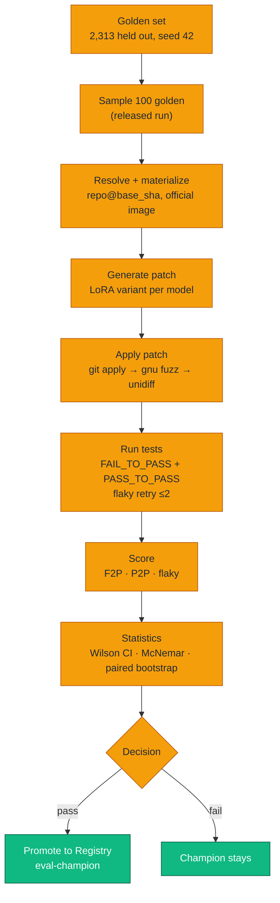

# Evaluation Methodology — F2P / P2P, Statistics, Golden Set Protocol

> SWE-Qwen does **execution-based** evaluation: it applies the model's generated patch inside the official SWE-bench container for that instance and runs the real test suites. No unit-test proxies, no LLM-as-judge. Code of truth: `evaluation/` (`harness.py`, `test_runner.py`, `patch_applier.py`, `stats.py`, `schema.py`).



---

## 1. Core Metrics

For each evaluated instance (`EvalResult` in `evaluation/schema.py`) the harness records: model, variant, prompt template, the generated patch, patch-application metadata, tests before/after, `f2p` (0/1), `p2p` (0/1), latency, and any error.

| Metric | Definition | Meaning |
| ------ | ---------- | ------- |
| **F2P (Fail-to-Pass)** | The model's patch caused ≥1 list item of `FAIL_TO_PASS` to flip from failing → passing, with no output above | The fix actually fixed the bug. This is the headline score |
| **P2P (Pass-to-Pass)** | Proportion of `PASS_TO_PASS` tests still passing after the patch | Regression safety: did the "fix" break unrelated behavior? 1.00 = nothing regressed |
| **Flaky rate** | Tests flapping across retries (≤2 retries, `flaky_threshold` 0.5) | Noise floor for trusting P2P |

Per-model aggregation is `F2PMetrics`: counts + rates for F2P and P2P, `avg_latency`, `flaky_test_rate`, and a **per-repo breakdown** (so a model that "wins" only on easy repos is visible).

### Reference result (released run — 100-instance golden sample, 4 variants)

| Model | Variant | F2P (Wilson 95% CI) | P2P | Avg latency | Flaky | Note |
| ----- | ------- | --- | --- | ------- | --- | --- |
| Qwen3-14B | base (`baseline`) | 2.46% (0.8–7.7%) | 28.54% | 10.04s | 0.06% | rejected: p2p<90%, f2p<15% |
| Qwen3-14B | `baseline_14b` | 12.30% (7.2–20.2%) | 85.90% | 9.47s | 0.03% | rejected: p2p<90% |
| Qwen3-14B | `higher_rank_14b` | **17.20% (11.1–25.8%)** | **90.10%** | **8.92s** | **0.01%** | **champion** |
| Qwen3-14B | `higher_lr_14b` | 14.80% (9.1–23.1%) | 87.60% | 9.12s | 0.02% | rejected: p2p<90% |

**Reading the numbers:** the released run is a 100-instance sample of the 2,313-example golden set — a real comparison, not a smoke test. `higher_rank_14b` clears every gate (F2P 17.20% ≥ 15%, P2P 90.10% ≥ 90%, significant gain over the base model) and is marked **champion**; the other three variants are rejected for failing the P2P floor. `McNemar p < 1e-6` and paired-bootstrap 95% CI lower bound > 0 confirm the F2P gain over the base Qwen3-14B (2.46% → 17.20%, 7.0×) is not chance, and `P2P Δ +61.6pt` (28.54% → 90.10%) quantifies the regression-safety win.

---

## 2. Pipeline Detail

### 2.1 Sampling (`eval run --split`)

| Variable | Value |
| -------- | ----- |
| Source | `golden` (default) or `swebench_verified` |
| Seeding | `tier_seed = 42`, deterministic subsetting |
| Tier sizes | `smoke` 20 · `dev` 100 · `final` 500 · `full` 50 (or `--sample 0` = whole golden) |
| `--sample N` override | truncates (golden capped at 50 to bound cost unless 0); the released run used an explicit 100-instance sample |

### 2.2 Execution

1. **Materialize** `repo@base_sha` with the official per-instance SWE-bench Docker image (cached on Modal, `eval-repo-cache` / `eval-test-cache` volumes).
2. **Generate** the patch: `--models qwen3-14b:baseline_14b,...` — each model string is copied to its own GPU task (up to `max_parallel=16`).
3. **Apply** (`patch_applier.py`): layered strategy — `git apply` → GNU `patch --fuzz` → `unidiff` fallback — and *recorded* (`PatchApplicationResult.method_used`), so "patch failed to apply" is diagnosably different from "patch applied but wrong".
4. **Test**: run `FAIL_TO_PASS` then `PASS_TO_PASS` inside the container; 30s per test, 300s per repo, ≤2 retries for flakes.
5. **Resume**: `--resume run_id` continues an interrupted run instead of re-burning GPU.

### 2.3 Cost controls

- Modal containers cold-start once; repo + image caching makes subsequent runs cheap.
- `--sample 50` keeps a CI inference run ~$1; a full golden run is bounded by `--sample`.
- Released 2-run × 4-model comparison (100 golden instances): **$30 est. total** (see `assets/results.txt`).

---

## 3. Statistical Grounding (`stats.py`)

Raw rate differences on finite samples are noise. Every comparison that can promote a champion uses:

| Method | Used for |
| ------ | -------- |
| **Wilson score interval** | Confidence interval around F2P / P2P rates (95%), reported per model |
| **McNemar's test** | Paired (per-instance) disagreement between two models — is the F2P gain real on the same instances? |
| **Paired bootstrap** | CI for the difference (gain) under resampling of instance-level outcomes |

The eval gate (`promotion/gate.py`) then requires, to promote a challenger:

1. **Absolute floor**: F2P ≥ `min_f2p_threshold` (15%) and P2P ≥ `min_p2p_threshold` (90%) on the paired dev eval.
2. **Gain is real**: challenger beats champion by the required margin **with a CI lower bound > 0** (i.e. McNemar says the improvement is not a coin flip).
3. **No regression**: P2P drop ≤ 2 points across the paired set.

Silent promotions (within noise) are rejected by design — a "win" that can't clear its own confidence interval is a fluke, not a win.

### 3.1 CI / smoke gating (`eval.yml`)

- `--mode smoke` runs the 20-instance tier as a **merge gate** on PRs touching eval/training/inference/config.
- **Baseline**: `{output_dir}/smoke_baseline.json` stores `{"dataset_run_id", "rates": {model:variant:prompt: f2p_rate}}`. PRs read it; pushes to `main` update it (`--update-baseline`) — self-certification is impossible.
- **Tolerance**: `_SMOKE_TOLERANCE = 0.05` absolute F2P drop against the baseline, plus the absolute `min_f2p_threshold` floor.

---

## 4. Golden Set Protocol

Why `golden` is sacred:

1. **Never touched by training.** The golden set is carved *before* tokenization (`golden.py`) from **verified** SWE-bench instances + test/dev slices, and is disjoint from train/val.
2. **Run-scoped.** Binds to a dataset `run_id` (`EVAL_DATASET_RUN_ID`); evaluation can never silently pick up a "better" oracle that makes results harder to compare.
3. **Fixed prompts.** Prompt templates live in `training/prompts/` and are shared with inference (`prompt_builder.py`) — an eval result is attributable to the model, not an ad-hoc prompt.
4. **Full audit.** Every run is a `EvalRun` in W&B (`swe-qwen` project) with per-example logging (patch + status), aggregate metrics, and `cost_usd`; a `compare` writes a markdown table and optionally promotes to the `eval-champion` registry collection.

---

## 5. Reproduce

```bash
export EVAL_DATASET_RUN_ID=expanded-repos

# Full 100-instance golden-sample comparison (4 variants) — released run
python -m evaluation.cli run --split golden --sample 100 --models qwen3-14b:baseline --resume run_baseline
python -m evaluation.cli run --split golden --sample 100 \
  --models qwen3-14b:baseline_14b,qwen3-14b:higher_rank_14b,qwen3-14b:higher_lr_14b --resume run_golden

# Statistical comparison + optional promotion
python -m evaluation.cli compare --run_ids run_baseline,run_golden --promote-to-registry

# CI gate only (no promotion)
python -m evaluation.cli run --mode smoke --ci-mode --models qwen3-14b:baseline_14b
```

---

## 6. Known Limitations

- **Execution on sampled splits** keeps costs sane; small samples have wide Wilson intervals — that's *why* the gate demands the CI lower bound.
- **P2P on 100-instance samples** is a moderate regression signal; larger golden runs tighten it further.
- **Image caching** keeps repos warm; brand-new instances pay a one-time cold start.
- **Flaky retries** guard against infra flapping but cannot catch deterministic environment drift (tracked via `flaky_rate`).