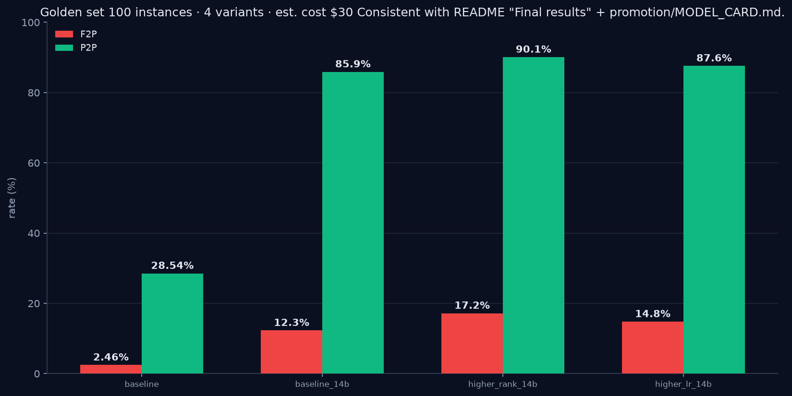

---
language:
  - en
license: apache-2.0
base_model: Qwen/Qwen3-14B
tags:
  - swe-bench
  - code
  - qwen
  - qlora
  - peft
  - software-engineering
pipeline_tag: text-generation
library_name: peft
---

# SWE-Qwen — Qwen3-14B `higher_rank_14b` (software-issue resolution)

`SWE-Qwen-qwen3-14b-higher_rank_14b` is a QLoRA fine-tune of **Qwen3-14B** for automated software-issue resolution: given a GitHub issue, it generates a patch that flips `FAIL_TO_PASS` tests and preserves `PASS_TO_PASS` tests inside the real repository.

## Model description

- **Base model:** [`Qwen/Qwen3-14B`](https://huggingface.co/Qwen/Qwen3-14B) (Apache-2.0)
- **Method:** QLoRA (4-bit NF4) via Unsloth + FlashAttention 2.8.3, trained on Modal serverless **A100-80GB**
- **Adapter:** `higher_rank_14b` — LoRA r=32, α=64, lr 2e-5, 1 epoch, bf16, `paged_adamw_8bit`, cosine (warmup 0.03), weight decay 0.01, max seq len 4,096, packing on
- **Training data:** 14,833 tokenized SWE-bench examples (curated from 17,456 cleaned records; repo-stratified, golden set 2,313 bypasses training)
- Full platform: [github.com/AhmedIkram05/SWE-Qwen](https://github.com/AhmedIkram05/SWE-Qwen)

## Evaluation results

Execution-based evaluation inside official SWE-bench Docker images on a **100-instance sample of the 2,313-instance golden set** (statistics: Wilson 95% CI, McNemar + paired bootstrap for champion selection):



| Variant | F2P (95% Wilson CI) | P2P | Latency | Flaky | Note |
| --- | ---: | ---: | ---: | ---: | --- |
| Qwen3-14B (base) | 2.46% (0.8–7.7%) | 28.54% | 10.04 s | 0.06% | rejected: p2p<90%, f2p<15% |
| baseline_14b (r16) | 12.30% (7.2–20.2%) | 85.90% | 9.47 s | 0.03% | rejected: p2p<90% |
| **higher_rank_14b** | **17.20% (11.1–25.8%)** | **90.10%** | **8.92 s** | **0.01%** | **champion** |
| higher_lr_14b | 14.80% (9.1–23.1%) | 87.60% | 9.12 s | 0.02% | rejected: p2p<90% |

**Champion vs base:** F2P **7.0×** (2.46% → 17.20%), P2P **+61.6pt** (28.54% → 90.10%); McNemar p < 1e-6, paired-bootstrap 95% CI lower bound > 0.

## Training details

- 3 QLoRA comparison variants (`baseline_14b`, `higher_rank_14b`, `higher_lr_14b`) on one A100-80GB budget; ~4,214 s (~1.2 h) per variant, champion `higher_rank_14b` final train loss **0.5843**
- Prompts are versioned Jinja2 templates shared with inference (no silent prompt drift between runs)
- Full experiment history: Weights & Biases (`model-qwen3-14b-{variant}`)

## Usage

Serve with vLLM (AWQ base + per-request LoRA swap; OpenAI-compatible):

```python
from vllm import LLM, SamplingParams

llm = LLM(model="Qwen/Qwen3-14B-AWQ", enable_lora=True)
params = SamplingParams(temperature=0.2, max_tokens=2048)
out = llm.generate(["<full prompt: system + issue>"], params, lora_request=...)  # adapter via LoRARequest
```

## Limitations & license

Fine-tune shares the base model's license (**Apache-2.0**). Benchmarks target the curated SWE-bench subset (Python); latency measured on warm Modal A100-80GB pull-through caching. Eval harness and full audit trail: see the [SWE-Qwen](https://github.com/AhmedIkram05/SWE-Qwen) repository.
